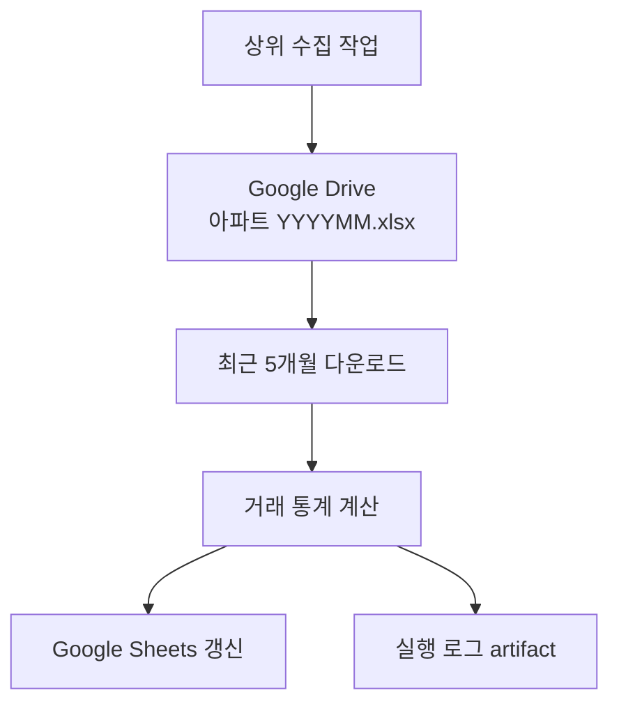

# file-record-analyze-automation

Google Drive에 저장된 월별 아파트 실거래 엑셀 파일을 읽어 통계를 계산하고, Google Sheets에 자동 기록하는 저장소입니다.

> 이 저장소는 국토교통부에서 원자료를 직접 수집하지 않습니다.
>
> 상위 수집 작업이 Drive에 올려 둔 `아파트 YYYYMM.xlsx` 파일을 입력으로 사용합니다.

## 처리 흐름

1. 지정된 Google Drive 폴더에서 `아파트 YYYYMM.xlsx` 형식의 파일을 찾습니다.
2. 월별로 가장 최근에 수정된 파일 1개를 선택하고, 최신 5개월분을 내려받습니다.
3. 거래건수·중앙값·평균가·전월 대비 건수 증감·예상건수를 계산합니다.
4. 지정된 Google Sheets의 전국·서울 월별 탭과 `거래요약` 탭을 갱신합니다.
5. 실행 로그를 `analyze_report/latest.log`에 남기고 Actions artifact로 업로드합니다.



## 입력 파일 조건

기본 파일명 정규식은 다음과 같습니다.

```text
^아파트\s*(\d{6})\.xlsx$
```

예: `아파트 202607.xlsx`, `아파트202607.xlsx`

엑셀 시트는 `data`, `Sheet1`, 첫 번째 시트 순서로 선택합니다. 분석에 사용하는 주요 열은 다음과 같습니다.

- `계약년`, `계약월`, `계약일`
- `거래금액(만원)`
- `광역`, `구`, `법정동`

## Google Sheets 기록 구조

### 월별 탭

- 전국: `전국 YY년 M월`
- 서울: `서울 YY년 M월`
- 같은 실행일의 행이 이미 있으면 새 행을 만들지 않고 해당 행을 갱신합니다.
- 전국 탭에는 전국 및 시·도별 거래건수를, 서울 탭에는 25개 자치구와 총합계를 기록합니다.

기존 탭은 공백을 제거한 이름으로도 찾아보며, 없으면 자동 생성합니다. 지원하는 이름 형식은 `전국 26년 7월`, `전국 7월`, `전국 2026년 7월`과 이에 대응하는 서울 탭입니다.

### `거래요약` 탭

기존 `거래요약` 탭이 있을 때만 아래 5개 행으로 구성된 월별 블록을 갱신합니다.

| 항목 | 내용 |
|---|---|
| 거래건수 | 해당 월의 실제 거래 행 수 |
| 중앙값(단위:억) | 거래금액 중앙값 |
| 평균가(단위:억) | 거래금액 평균 |
| 전월대비 건수증감 | 직전 처리 월과의 거래건수 차이 |
| 예상건수 | 당월 누적 건수를 경과일 기준으로 단순 비례한 월말 예상치 |

`거래요약` 탭이 없거나 첫 행의 지역 헤더가 없으면 요약 기록은 건너뜁니다.

## GitHub Actions

### `analyze-and-update-sheets.yml`

현재 스크립트의 환경변수와 일치하는 기본 실행 워크플로입니다.

- 자동 실행: 매일 `00:00 UTC` (`09:00 KST`)
- 수동 실행: Actions → `analyze-and-update-sheets` → **Run workflow**
- 실행 파일: `scripts/analyze_and_update.py`
- 결과 artifact: `analyze_report`

### `molit.yml` 주의사항

매일 `00:05 UTC` (`09:05 KST`)에도 같은 분석 스크립트를 실행하도록 설정되어 있어 기본 워크플로와 중복 실행될 수 있습니다. 또한 현재 이 파일은 `DRIVE_PARENT_FOLDER_ID`와 `DRIVE_SUBFOLDER_NAME`을 넘기지만, 분석 스크립트는 `DRIVE_FOLDER_ID`를 필수로 읽습니다. 따라서 수정 없이 실행하면 `DRIVE_FOLDER_ID 환경변수가 필요합니다` 오류가 발생할 수 있습니다.

둘 중 하나만 예약 실행하도록 정리하고, `molit.yml`을 유지한다면 `DRIVE_FOLDER_ID`를 secret 또는 환경변수로 전달해야 합니다.

### `artifact-inspector.yml`

수동 진단용 워크플로입니다. 별도 저장소 `ckh3455/file-automation`의 성공한 `molit.yml` artifact를 내려받아 파일 목록만 출력합니다. 분석이나 Google Sheets 기록은 수행하지 않습니다.

## GitHub Secrets 설정

`analyze-and-update-sheets.yml` 기준으로 저장소의 **Settings → Secrets and variables → Actions**에 다음 repository secrets가 필요합니다.

| Secret | 용도 |
|---|---|
| `SHEET_ID` | 갱신할 Google Sheets 문서 ID |
| `DRIVE_FOLDER_ID` | 입력 엑셀 파일이 있는 Google Drive 폴더 ID 또는 폴더 URL |
| `GDRIVE_SA_JSON` | Google 서비스 계정 키 JSON 전체 내용 |
| `DRIVE_SUPPORTS_ALL_DRIVES` | 공유 드라이브를 포함하면 `true`; 현재 워크플로의 사전 점검상 필수 |

서비스 계정에는 다음 권한이 필요합니다.

- 입력 Drive 폴더 및 파일 읽기 권한
- 대상 Google Sheets 편집 권한

서비스 계정 이메일을 Drive 폴더와 Google Sheets 문서에 공유해야 합니다. 서비스 계정 JSON은 파일로 커밋하지 마십시오.

`artifact-inspector.yml`을 사용할 때는 원본 저장소의 Actions artifact를 읽을 수 있는 `SOURCE_REPO_PAT`도 필요합니다.

## 로컬 실행

Python 3.11 기준입니다.

```bash
python -m venv .venv
source .venv/bin/activate
python -m pip install --upgrade pip
pip install -r requirements.txt
```

환경변수를 설정한 뒤 실행합니다.

```bash
export SHEET_ID="대상_시트_ID"
export DRIVE_FOLDER_ID="입력_폴더_ID"
export DRIVE_SUPPORTS_ALL_DRIVES="true"
export SA_PATH="/안전한/경로/service-account.json"
python scripts/analyze_and_update.py
```

로컬에서는 `SA_PATH` 대신 `SA_JSON` 또는 `GDRIVE_SA_JSON`에 JSON 전체 내용을 넣어도 됩니다.

## 선택 환경변수

| 변수 | 기본값 | 설명 |
|---|---:|---|
| `DRIVE_FILE_REGEX` | `^아파트\s*(\d{6})\.xlsx$` | 입력 파일명 정규식 |
| `DRIVE_SCAN_MAX_FILES` | `1000` | Drive에서 한 번에 조회할 최대 파일 수 |
| `DOWNLOAD_DIR` | `_drive_downloads` | 임시 다운로드 폴더 |
| `EXCEL_SHEET_NAME` | 자동 선택 | 강제로 읽을 엑셀 시트명 |
| `MONTH_WS_MIN_ROWS` | `400` | 월별 탭 최소 행 수 |
| `MONTH_WS_MIN_EXTRA` | `30` | 행 확장 시 추가 여유 행 수 |
| `MONTH_WS_MIN_COLS` | `40` | 월별 탭 최소 열 수 |

## 보조 스크립트와 현재 상태

- `scripts/analyze_and_update.py`: 실제 Drive → 분석 → Sheets 기록 작업
- `scripts/pull_from_drive.py`: Drive 폴더의 XLSX를 로컬 `artifacts` 폴더로 받는 독립 보조 도구이며 현재 Actions에서는 호출하지 않음
- `scripts/rt_allinone.py`: 현재 내용이 없는 자리표시자 파일
- `_rt_downloads`, `analyze_report`, `output`: 디렉터리 이름을 저장소에 유지하기 위한 자리표시자 파일. 실행 시 동명의 디렉터리로 대체되거나 `.gitignore` 대상이 됨

## 자주 발생하는 오류

### `DRIVE_FOLDER_ID 환경변수가 필요합니다`

`DRIVE_FOLDER_ID` secret이 없거나 워크플로에서 다른 이름으로 전달된 경우입니다. 특히 현재 `molit.yml`은 이 문제가 있으므로 위의 주의사항을 확인하십시오.

### Drive에서 파일을 찾지 못함

- 파일명이 `아파트 YYYYMM.xlsx` 형식인지 확인합니다.
- 서비스 계정에 폴더 읽기 권한이 있는지 확인합니다.
- 하위 폴더는 자동 탐색하지 않으므로 실제 파일이 들어 있는 폴더 ID를 지정합니다.

### `거래요약`이 갱신되지 않음

시트에 `거래요약` 탭이 있는지, 첫 행 C열 이후에 코드가 집계하는 지역명이 적혀 있는지 확인합니다.

### 동일 시간대에 두 번 실행됨

현재 두 예약 워크플로가 5분 간격으로 같은 스크립트를 실행할 수 있습니다. 사용할 워크플로 하나만 남기거나 다른 워크플로의 `schedule`을 제거하십시오.
